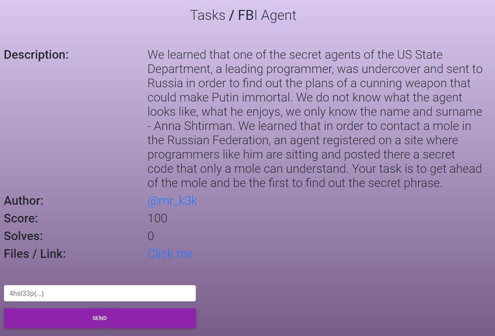
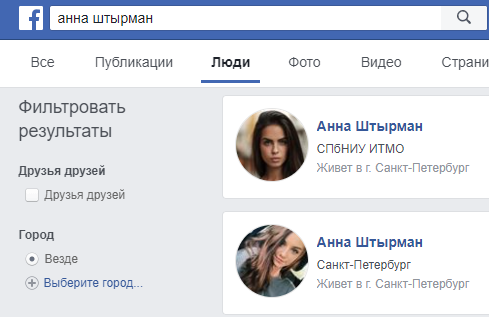
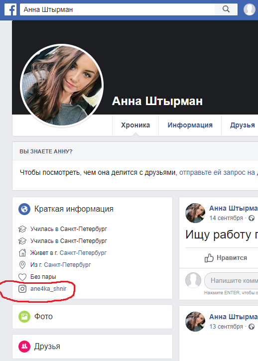
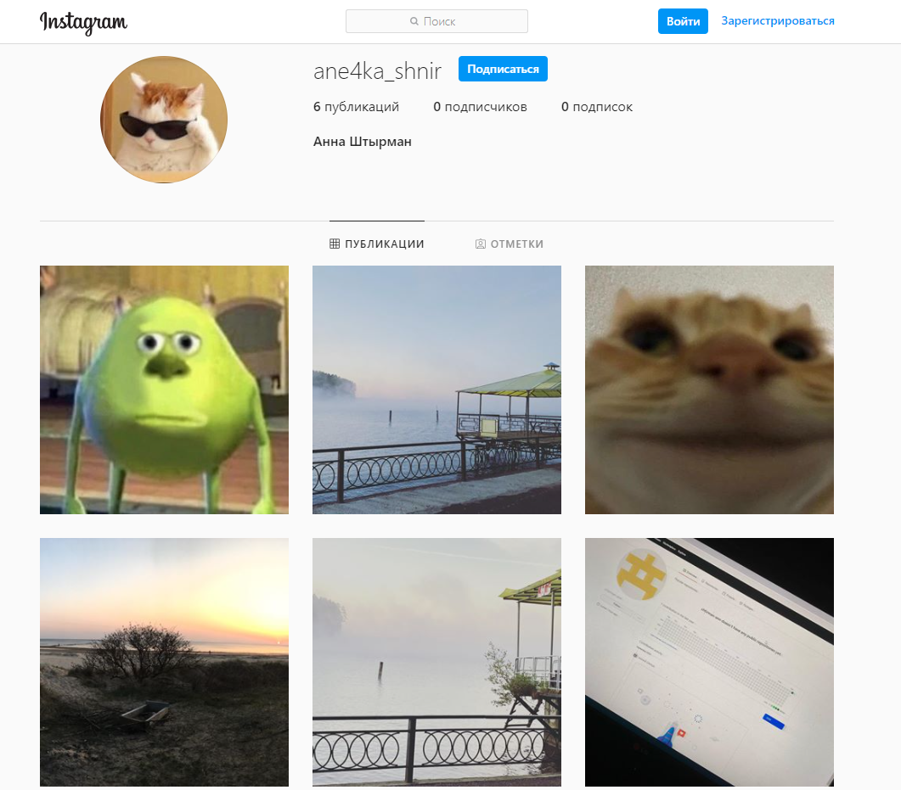
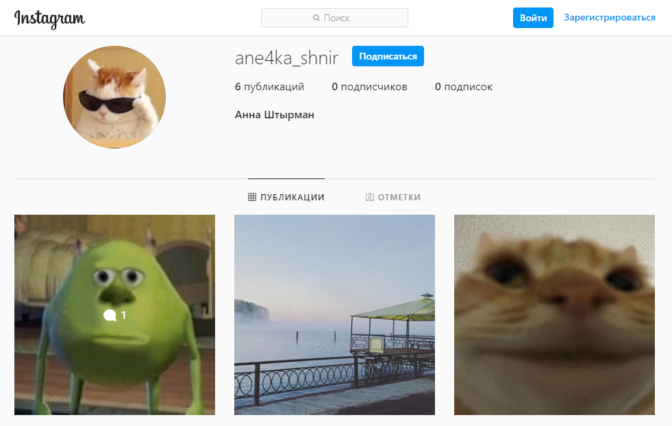
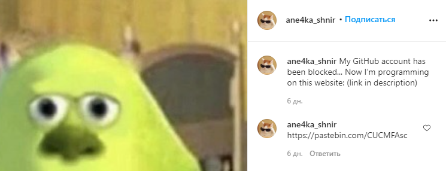
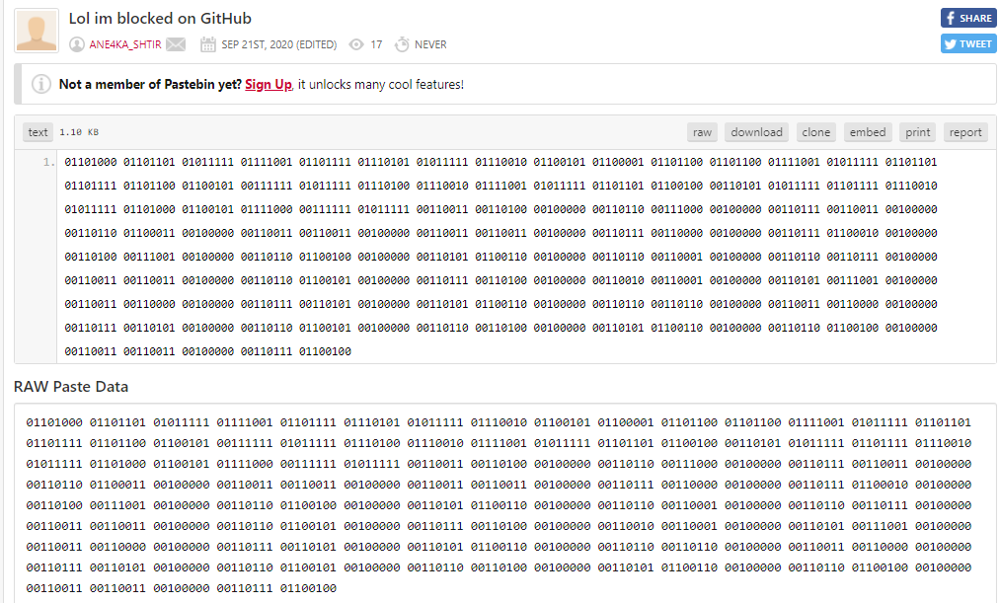
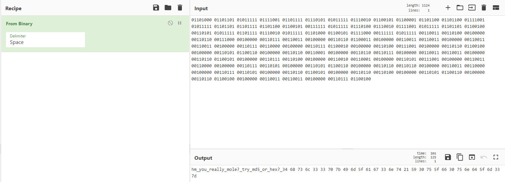
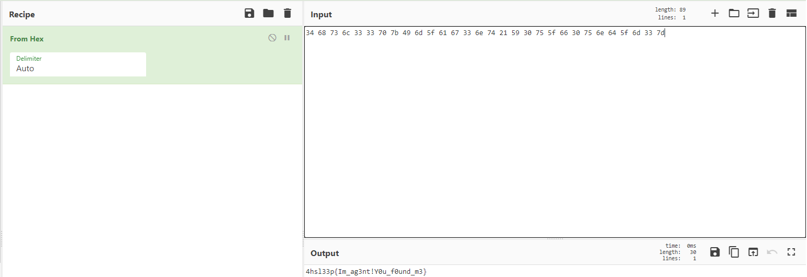

#FBI Agent  

Если обратить внимание на название таска, а конкретно на слово FBI то можно предположить, что в названии скрыта отсылка на FaceBook, зайдя туда пробуем найти кого-то с именем «Анна Штырман»:

Видим две страницы с таким именем и проверяем их по очереди. Чекнув первую – ничего не обнаружим, пройдясь по страничке второй увидим интересную ссылочку на Instagram:

Переходим по ней и получаем вот такое:

Если по наводиться на фотки мышкой, то увидим, что только у первой есть комментарий:

Тыкаеми видим:

Переходим по ссылочке и натыкаемся на это:

Первое что приходит в голову – декодировать бинарный код, что и делаем в CyberChef:

Читаем, что получилось и видим новую кодировку, которую предлагают расшифровать в md5 или hex, можно попробовать md5 и у вас ничего не получится, потом запустить hex и получить:

Флаг - 4hsl33p{Im\_ag3nt!Y0u\_f0und\_m3}
